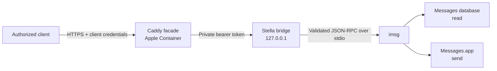

<!-- markdownlint-disable MD033 -->
<p align="center">
  
</p>
<h1 align="center">Stella</h1>
<p align="center">
  <strong>A small, security-first iMessage proxy for macOS and private networks.</strong>
</p>
<p align="center">
  <a href="https://github.com/mglaeser/stella/actions/workflows/ci.yml"></a>
  <a href="https://github.com/mglaeser/stella/releases"></a>
  <a href="LICENSE"></a>
  <a href="ROADMAP.md"></a>
  <a href="docs/operations.md"></a>
</p>
<!-- markdownlint-enable MD033 -->

Stella exposes a deliberately narrow Messages interface to explicitly authorized clients on a trusted LAN or VPN. A native, loopback-only bridge validates every request before handing an allowlisted operation to [`imsg`](https://github.com/openclaw/imsg). A Caddy facade supplies TLS and per-client authentication at the private-network boundary.

> [!WARNING]
> Stella is **Alpha software**. It handles private conversations and can send messages as the signed-in macOS user. Review the threat model, test with a harmless recipient, and keep it off the public Internet.

## Why Stella?

- **Small attack surface.** Five read/send RPC methods; everything else is rejected.
- **Deny-by-default sending.** Exact recipients or chats must be placed on a local allowlist.
- **Two authentication boundaries.** Clients authenticate to Caddy; Caddy authenticates separately to the loopback bridge.
- **Private by construction.** The native service binds to `127.0.0.1`, while the facade is intended only for a private LAN or VPN.
- **Bounded payloads.** Request, response, method, attachment, and text limits are enforced at the bridge boundary.
- **Useful audit trails.** Logs identify caller, method, outcome, and duration without recording message contents or recipients.
- **macOS-native permissions.** Messages access stays inside the signed-in user's GUI session and normal TCC controls remain enabled.

## How it works



The facade is the only network-facing component. The bridge is not a general-purpose Messages server: it strips or rejects unsupported parameters and forces sends through the normal AppleScript transport. See [Architecture](docs/architecture.md) and [Security model](docs/security.md).

## Scope

Stella currently supports:

- health checks that exercise the `imsg` read path;
- listing chats and reading bounded message history;
- cursor-based polling for new messages;
- sending text to an explicitly allowed address or chat;
- checking a sent message's status;
- an immediate-send, Sipgate-shaped compatibility endpoint.

Stella intentionally does **not** provide anonymous access, Internet exposure, attachments, webhooks, reactions, contact access, remote URL fetching, message mutation, typing indicators, private framework injection, or scheduled sending.

## Requirements

- a Mac supported by [Apple Container](https://github.com/apple/container), with the Container CLI installed and running;
- a non-root macOS GUI user signed in to Messages;
- Xcode Command Line Tools (`xcode-select --install`);
- [`imsg`](https://github.com/openclaw/imsg) installed for that user;
- Git, Make, OpenSSL, `jq`, and `curl`;
- private DNS and a LAN/VPN path between clients and the Mac;
- a reviewed Caddy image pinned by SHA-256 digest.

Stella has not yet published a broad macOS compatibility matrix. Treat upgrades to macOS, Apple Container, `imsg`, or Caddy as security-sensitive changes and re-run the smoke tests.

## Quick start

Clone and verify the source:

```bash
git clone https://github.com/mglaeser/stella.git
cd stella
make build
make test
```

Create a local configuration from the public example and replace every placeholder:

```bash
cp config/stella.env.example stella.env
chmod 600 stella.env
${EDITOR:-vi} stella.env
set -a
. ./stella.env
set +a
```

Prepare local state, validate the native bridge, and inspect the generated LaunchAgent before installing it:

```bash
bin/stella prepare
bin/stella build-host
bin/stella check-host
bin/stella agent-install
bin/stella agent-status
```

Then create the private host route, generate a caller password hash, and start the facade. Each operation prints its prerequisites; do not bypass its confirmation gates.

```bash
bin/stella host-route-create
bin/stella hash-password
bin/stella create
bin/stella status
```

The complete, review-first procedure is in [Operations](docs/operations.md). Existing installations extracted from another administration repository should follow the [migration guide](docs/migration-from-administration.md).

## First request

Export the private API origin and use the Caddy root CA—never `curl -k`. `curl` prompts for the caller's password:

```bash
export STELLA_URL=https://messages.example.internal:9443

curl \
  --cacert /secure/path/stella-root.crt \
  --user automation-a \
  "$STELLA_URL/healthz"
```

Read a bounded page after cursor zero:

```bash
curl \
  --cacert /secure/path/stella-root.crt \
  --user automation-a \
  --header 'Content-Type: application/json' \
  --data '{"jsonrpc":"2.0","id":"poll-1","method":"messages.after","params":{"since_rowid":0,"limit":20}}' \
  "$STELLA_URL/v1/rpc"
```

For production-like automation, store the returned cursor durably and use a distinct credential for every client. See the full [API reference](docs/api.md) and machine-readable [OpenAPI 3.1 description](openapi.yaml).

## Repository layout

```text
.
├── bin/stella                              # lifecycle and deployment manager
├── config/Caddyfile                        # authenticated TLS facade
├── config/io.github.mglaeser.stella.plist.in
├── config/stella.env.example
├── docs/                                   # design and operator guides
├── openapi.yaml                            # machine-readable HTTPS API contract
├── src/stella-bridge.m                     # native loopback bridge
└── tests/test-stella-bridge.sh              # integration-focused shell tests
```

## Project status

The current version is **0.1.0** and the maturity level is **Alpha**. Interfaces, state layout, and operator commands may change before 1.0. Changes are recorded in the [changelog](CHANGELOG.md), and intended milestones live in the [roadmap](ROADMAP.md).

## Community and security

- Read [Contributing](CONTRIBUTING.md) before opening a pull request.
- Use [GitHub Discussions](https://github.com/mglaeser/stella/discussions) for usage questions.
- Report vulnerabilities privately according to [Security](SECURITY.md)—not in a public issue.
- Project decisions and maintainer responsibilities are described in [Governance](GOVERNANCE.md).
- Participation is governed by our [Code of Conduct](CODE_OF_CONDUCT.md).

## License and non-affiliation

Licensed under the [Apache License 2.0](LICENSE). See [NOTICE](NOTICE) for attribution information.

Stella is an independent open-source project. It is not affiliated with, endorsed by, or sponsored by Apple Inc. iMessage and macOS are trademarks of Apple Inc. Use of those names describes interoperability only.
