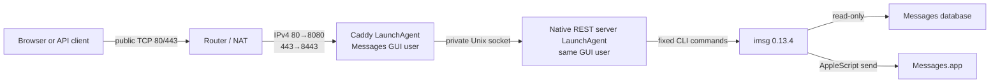

<!-- markdownlint-disable MD033 -->
<p align="center">
  
</p>
<h1 align="center">iMessage Proxy</h1>
<p align="center">
  <strong>A small, security-first REST API for Messages.app.</strong>
</p>
<p align="center">
  <a href="https://github.com/mglaeser/imessage-proxy/actions/workflows/ci.yml"></a>
  <a href="https://github.com/mglaeser/imessage-proxy/releases"></a>
  <a href="LICENSE"></a>
  <a href="docs/operations.md"></a>
</p>
<!-- markdownlint-enable MD033 -->

iMessage Proxy turns a signed-in Mac into a deliberately small HTTPS service for
reading conversations and sending iMessages. It keeps Messages access in the
normal macOS user session, exposes only explicit REST resources, and authenticates
every API request with a scoped, revocable key.

## Get started

Run this on the Mac that is signed in to Messages:

```bash
curl -fsSL https://raw.githubusercontent.com/mglaeser/imessage-proxy/main/scripts/install.sh | bash
```

That one command checks the Mac, fetches and verifies the source, builds and
installs the CLI, installs the pinned [`imsg`](https://github.com/openclaw/imsg)
and Caddy dependencies, writes one private configuration file, starts the
service, and prints your first API key. Every executable it downloads is
verified against a digest recorded in the script.

It asks only for the two things it cannot know: a hostname and an operator
email. macOS then prompts once for Full Disk Access, which is the single manual
step.

Add one recipient to the allowlist it prints, then send a message straight over
the private socket:

```bash
curl --fail-with-body \
  --unix-socket "$HOME/Library/Application Support/iMessage Proxy/run/server.sock" \
  --header "Authorization: Bearer $IMESSAGE_PROXY_API_KEY" \
  --header "Idempotency-Key: $(uuidgen)" \
  --header 'Content-Type: application/json' \
  --data '{"recipient":"person@example.net","text":"Hello from iMessage Proxy"}' \
  http://localhost/api/messages
```

The installer leaves the service on that private Unix socket with no network
listener, so nothing is reachable from outside the Mac until you deliberately
enable public HTTPS. Prefer to read the script before running it? Download it
first:

```bash
curl -fsSLO https://raw.githubusercontent.com/mglaeser/imessage-proxy/main/scripts/install.sh
less install.sh
bash install.sh
```

> [!IMPORTANT]
> The repository can prepare an Internet-facing service, but it cannot safely
> expose a real Mac without a real hostname, reviewed IPv4 DNS and port mapping,
> firewall decisions, a maintenance window, and acceptance tests on that Mac.
> Keep the public-exposure gate disabled until the complete operations checklist
> passes.

## Send an iMessage with one POST

> [!TIP]
> **As straightforward as an SMS API.** Supply a recipient and text—no protocol
> envelope, session resource, or provider-specific payload.

```bash
export IMESSAGE_PROXY_URL='https://messages.example.com'
export IMESSAGE_PROXY_API_KEY='imp_REPLACE_WITH_YOUR_KEY'

curl --fail-with-body \
  --request POST \
  --header "Authorization: Bearer $IMESSAGE_PROXY_API_KEY" \
  --header "Idempotency-Key: $(uuidgen)" \
  --header 'Content-Type: application/json' \
  --data '{"recipient":"person@example.net","text":"Hello from iMessage Proxy"}' \
  "$IMESSAGE_PROXY_URL/api/messages"
```

```json
{"operation_id":"7B740A82-2149-43DB-BE37-6F3D28711A47","state":"accepted"}
```

`202 Accepted` means Messages.app accepted the command. It is not delivery
confirmation. Each logical send needs an idempotency key, and the recipient must
appear in the local allowlist. The service forces iMessage and disables
carrier-SMS fallback.

## Why this project stays small

- **Two host-native processes.** Caddy terminates public HTTPS; one native macOS
  server validates requests and invokes `imsg`. Both are user LaunchAgents.
  SQLite and the browser console add no service process.
- **One private Unix socket.** Caddy connects directly to the server through a
  local socket. There is no VM, container, socket relay, mount, internal TCP
  bridge, synthetic hostname, packet-filter rule, or reboot-time route repair.
- **One authentication model.** Every `/api` route accepts only a bearer API key.
  Keys are scoped, expiring, revocable, and stored as SHA-256 hashes.
- **Explicit adapters.** Requests map to reviewed `imsg 0.13.4` commands with
  fixed arguments and bounded output. Callers can never submit command names,
  filesystem paths, database paths, or arbitrary flags.
- **Safe sends.** Exact target allowlisting, durable idempotency, no wildcard,
  no automatic retry after an ambiguous outcome, and no SMS fallback.
- **Normal macOS protections.** System Integrity Protection and TCC stay enabled.
  The project does not inject code into Messages.app or call private messaging
  APIs.

## Architecture



Caddy serves the static management console and forwards only `/api` to the Unix
socket. High host ports avoid a root daemon; the external router must map public
TCP 80 and 443 exactly to the configured host IPv4 ports, which default to 8080
and 8443. Its explicit HTTP route redirects only the configured hostname to the
ordinary public HTTPS URL; it never publishes the internal `:8443` port.

Caddy and the REST server run as the same macOS GUI user. The socket narrows
network reachability, but it is not a privilege boundary between those processes.
Caddy necessarily sees bearer keys while terminating TLS and must be treated as
part of the trusted service. Grant Full Disk Access and Messages Automation only
to the exact REST-server binary—never to Caddy. See
[Architecture](docs/architecture.md) and [Security](docs/security.md).

## API at a glance

| Method | Resource | Scope | Purpose |
| --- | --- | --- | --- |
| `GET` | `/api/status` | any valid key | Check service and Messages readiness |
| `GET` | `/api/chats` | `messages:read` | List recent or unread chats |
| `GET` | `/api/chats/{id}` | `messages:read` | Read chat metadata and participants |
| `GET` | `/api/chats/{id}/messages` | `messages:read` | Read bounded chat history |
| `GET` | `/api/chats/{id}/background` | `messages:read` | Inspect scrubbed background/cache state |
| `GET` | `/api/scheduled-messages` | `messages:read` | Inspect future Send Later rows |
| `GET` | `/api/statistics/messages` | `messages:read` | Calculate message/media statistics |
| `POST` | `/api/messages` | `messages:send` | Send allowlisted iMessage text |
| `GET` | `/api/audit-events` | `admin` | Review bounded privacy-safe request metadata |
| `GET` | `/api/keys` | `admin` | List key metadata |
| `POST` | `/api/keys` | `admin` | Create and reveal a key once |
| `GET` | `/api/keys/{id}` | `admin` | Read one key's non-secret metadata |
| `DELETE` | `/api/keys/{id}` | `admin` | Revoke a key immediately |

The complete examples and error semantics are in [API](docs/api.md), with a
machine-readable [OpenAPI 3.1 contract](openapi.yaml).

## Management console

Open the service origin in a browser and enter an administrator key. The
same-origin console has three focused spaces:

- **Overview** shows service, Messages, version, and uptime health;
- **API playground** runs every read endpoint and intentional text sends with
  typed inputs, automatic bearer authentication, bounded literal JSON output,
  send confirmation, and safe idempotency handling; and
- **API keys** lists metadata, creates scoped keys, reveals each new credential
  once, and confirms revocation.

The entered key lives only in that tab's `sessionStorage`. Requests stay on the
service origin, and the console uses no cookies, analytics, third-party assets,
external fonts, or service worker.

## Requirements

- a supported macOS release and a non-root GUI user signed in to Messages;
- Full Disk Access for the exact native REST-server binary;
- Messages Automation permission for intentional sends;
- Xcode Command Line Tools, `curl`, `unzip`, and the standard macOS tools used by
  the lifecycle CLI, plus Node.js **22.12 or newer within major 22** to run the
  dependency-free console tests;
- [`imsg`](https://github.com/openclaw/imsg) **0.13.4** and host-native Caddy
  **2.11.4**, each pinned by digest. The [Get started](#get-started) installer
  downloads and verifies both for you; supply your own reviewed executables with
  `--imsg` and `--caddy` when a deployment requires it; and
- for public mode, a dedicated hostname with an IPv4 `A` record and an external
  router/firewall that maps TCP 80 to the configured host HTTP port and TCP 443
  to the configured host HTTPS port.

Those public address-and-port mappings are exclusive: they apply to every
hostname on that public IPv4 address, not just the iMessage Proxy hostname. If
another ingress already owns TCP 80/443, use a separately reviewed shared-edge
design or another public address; do not enable this direct edge alongside it.

The built-in edge is IPv4-only. Do not publish an `AAAA` record for it. A direct
public IPv6 path or a different upstream proxy is a separate architecture and
requires its own threat model.

## Install and run manually

The [Get started](#get-started) one-liner automates everything in this section
by wrapping [`scripts/install.sh`](scripts/install.sh). Follow the manual path
when you want to review each step, install from a specific checkout, or recover
an existing deployment. The installer accepts `--source DIR`, `--tag`,
`--archive`, `--sha256`, `--imsg`, `--caddy`, `--host`, `--email`, `--prefix`,
and `--no-tests`; run it with `--help` for the full list.

Build and test a reviewed source checkout:

```bash
make build
make test
make install
export PATH="$HOME/.local/bin:$PATH"
command -v imessage-proxy
```

The default install prefix is `$HOME/.local`; the final command must resolve its
CLI from `$HOME/.local/bin`. Add that directory to your shell startup file or use
the absolute CLI path in future sessions. Copy the configuration outside the
repository, protect it, and replace every example value. Configure independently
reviewed executable paths and digests for both `imsg` and Caddy as described in
[Operations](docs/operations.md).

```bash
mkdir -p "$HOME/.config/imessage-proxy"
install -m 600 config/imessage-proxy.env.example \
  "$HOME/.config/imessage-proxy/service.env"
${EDITOR:-vi} "$HOME/.config/imessage-proxy/service.env"
```

Do not source this file for the one-command path. `bootstrap --config` parses it
as a closed data format and never executes its contents.

### One-command first run

After the reviewed dependencies and private configuration file exist, one
command validates, prepares, builds, starts the native service, and creates the
first administrator as its final operation:

```bash
imessage-proxy bootstrap \
  --config "$HOME/.config/imessage-proxy/service.env" \
  --admin-name local-bootstrap \
  --expires-in-days 30
```

The bootstrap-only administrator label must contain 1–80 printable ASCII bytes
without leading or trailing spaces. Additional keys created through the API keep
the full Unicode naming contract documented in [API reference](docs/api.md).

The command pauses once so macOS can grant Full Disk Access to the exact binary
it just built. It does not probe the Messages read path before installing: any
such check runs under your terminal's Full Disk Access identity, which differs
from the installed LaunchAgent's. Messages availability is therefore reported by
`GET /api/status` rather than by refusing to install, and a service that starts
without that access still completes the install and issues the key while
printing a `NOTICE` naming the binary to grant. `imessage-proxy server-logs`
prints the running service's own log. All progress goes to standard error;
successful standard output is exactly the one-time
`imp_…` administrator key, ready to move directly into a password manager or
secret store. No key is written to a file, argument, environment variable, or
log. Accept the printed key only when the command exits with status zero; if the
final database commit fails after output, that candidate is deliberately unusable
and a retry remains possible.

For an already reviewed public hostname, DNS, IPv4 port mapping, firewall, and
acceptance plan, set `IMESSAGE_PROXY_ENABLE_PUBLIC_HTTPS=yes` in the private
configuration and make the same one command start the HTTPS console and API:

```bash
imessage-proxy bootstrap \
  --config "$HOME/.config/imessage-proxy/service.env" \
  --admin-name local-bootstrap \
  --expires-in-days 30 \
  --public \
  --confirm 'EXPOSE IMESSAGE PROXY PUBLICLY'
```

Without `--public`, bootstrap requires the gate to be `no` and leaves Caddy and
all host TCP listeners stopped. With `--public`, both the gate and the exact
confirmation are mandatory. The command never changes DNS, NAT, firewall, SIP,
or TCC settings for you.

### Manual lifecycle

The individual lifecycle actions use environment variables. For this manual
path only, load the already reviewed private file without printing it:

```bash
set -a
. "$HOME/.config/imessage-proxy/service.env"
set +a
```

Prepare a completely fresh 1.0 state tree and build the native server:

```bash
imessage-proxy doctor
imessage-proxy prepare
imessage-proxy build-host
```

Create the first short-lived administrator key locally. It is printed once;
store it in a password manager before clearing the terminal:

```bash
imessage-proxy api-key bootstrap-admin \
  --name local-bootstrap \
  --expires-in-days 30
imessage-proxy check-host
```

Edit the exact-target allowlist printed by `prepare`, then install the server
LaunchAgent:

```bash
${EDITOR:-vi} "$HOME/Library/Application Support/iMessage Proxy/private/allowed-targets.txt"
imessage-proxy server-install
imessage-proxy server-status
imessage-proxy server-logs
```

At this point only the private Unix-socket service exists. There is no network
listener. `server-logs` prints the last 100 lines of the private server log, and
the start, restart, and install actions tail it automatically when the socket
does not appear.

## Enable public HTTPS deliberately

Complete [Public exposure](docs/operations.md#public-exposure-gate) first. The
gate requires a real hostname and IPv4 `A` record, exact external
80→host-HTTP/443→host-HTTPS mappings, reviewed firewall state, a maintenance
window, and real-Mac acceptance. Then set:

```bash
export IMESSAGE_PROXY_ENABLE_PUBLIC_HTTPS=yes
imessage-proxy edge-install --confirm 'EXPOSE IMESSAGE PROXY PUBLICLY'
imessage-proxy edge-status
imessage-proxy edge-logs
```

The host-native Caddy LaunchAgent listens on the configured unprivileged IPv4
ports (8080/8443 by default), obtains a normal public certificate, serves the
console, and forwards `/api` through the local socket. Public clients still use
ordinary `https://HOST/`; the external router performs the port mapping.
`edge-stop` disables the launchd label before unloading it, so the edge remains
stopped across login and reboot; `edge-start` explicitly re-enables it.

## Uninstall

[`scripts/uninstall.sh`](scripts/uninstall.sh) reverses the installer. It stops
and removes both LaunchAgents, deletes the CLI, the installed assets, the pinned
`imsg` and Caddy dependencies, and the private configuration file:

```bash
bash scripts/uninstall.sh --dry-run
bash scripts/uninstall.sh
```

Start with `--dry-run`; it prints every path it would touch and changes nothing.

Runtime state is kept by default, so your API keys, send allowlist,
certificates, and logs survive and a later reinstall adopts them. Destroying
that state is a separate, deliberate decision:

```bash
bash scripts/uninstall.sh --purge --confirm 'DESTROY IMESSAGE PROXY STATE'
```

Add `--include-legacy` to also remove pre-1.0 Stella-era artifacts. Two things
no script may revoke on macOS: delete the Full Disk Access and Automation
entries for the removed server binary in System Settings, or a stale entry will
point at a binary that no longer exists.

## Scope and non-goals

The 1.0 surface covers stable, non-injected `imsg` capabilities that make sense
across a remote security boundary: chat discovery, bounded history, scrubbed
chat-background state, scheduled-message inspection, statistics, and text sends.

It intentionally does not expose live infinite streams, Contacts-assisted
whois/identity lookup, attachment file paths or uploads, arbitrary databases,
carrier SMS, UI-driven reactions, read receipts, typing indicators, message
mutation, chat management, rich effects, stickers, polls, private frameworks, or
code injection. Those features require different privacy, streaming, upload, or
macOS security models; they are not hidden generic commands.

Cross-chat text search is also excluded from 1.0: the pinned dependency couples
that command to Contacts access and has no no-Contacts mode. Exposing it would
allow a remote read request to trigger a TCC prompt or enumerate address-book
data, which does not fit the minimum permission boundary.

## Repository layout

```text
.
├── bin/imessage-proxy                         # lifecycle and deployment manager
├── config/Caddyfile                           # native HTTPS/static/API edge
├── config/io.github.mglaeser.imessage-proxy.plist.in
├── config/io.github.mglaeser.imessage-proxy.edge.plist.in
├── src/api-key-store.{h,m}                    # SQLite keys, audit, idempotency
├── src/imessage-proxy-server.m                # Unix-socket REST server
├── scripts/install.sh                         # one-command install and first run
├── scripts/uninstall.sh                       # guarded removal, state opt-in
├── web/                                       # dependency-free management console
├── openapi.yaml                               # public API contract
├── REVISION                                   # immutable commit embedded in release archives
└── tests/                                     # native, edge, and lifecycle tests
```

## Community and security

- Read [Contributing](CONTRIBUTING.md) before opening a pull request.
- Use [GitHub Discussions](https://github.com/mglaeser/imessage-proxy/discussions) for usage questions.
- Report vulnerabilities privately according to [Security policy](SECURITY.md).
- Project decisions and maintainer responsibilities are in [Governance](GOVERNANCE.md).
- Participation is governed by the [Code of Conduct](CODE_OF_CONDUCT.md).

Licensed under the [Apache License 2.0](LICENSE). See [NOTICE](NOTICE) for
attribution information. iMessage Proxy is independent software and is not
affiliated with, endorsed by, or sponsored by Apple Inc. iMessage and macOS are
trademarks of Apple Inc.; their names describe interoperability only.
