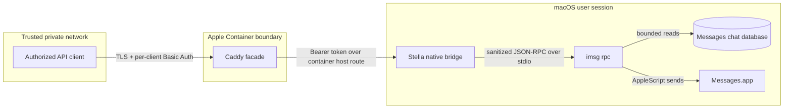

# Architecture

This document explains Stella's components, trust boundaries, and design invariants. It describes version 0.1.1; Alpha interfaces may change.

## Design goals

Stella exists to make a small subset of Messages functionality available to explicit automation clients without turning a Mac into a general-purpose remote-control server.

The design optimizes for:

- private LAN/VPN operation;
- a narrow, inspectable native bridge;
- deny-by-default outbound messaging;
- independent credentials at each trust boundary;
- ordinary macOS TCC, SIP, Messages, and GUI-session behavior;
- minimal logs and recoverable local state;
- explicit operator actions for security-sensitive lifecycle changes.

Convenience, unrestricted API compatibility, public hosting, and multi-tenant isolation are non-goals.

## System context



The native bridge listens only on `127.0.0.1`. Apple Container's explicit host route connects the facade to that listener. The facade publishes HTTPS only on an operator-selected private interface.

## Components

| Component | Responsibility | Deliberate limitation |
| --- | --- | --- |
| `src/stella-bridge.m` | Parse HTTP, authenticate the facade, validate/sanitize JSON, enforce API and target policy, invoke `imsg rpc`, and emit minimal audit events | Loopback-only; no TLS, client credential store, or general RPC passthrough |
| `imsg` | Use supported macOS capabilities to read Messages data and send through Messages.app | Executed as a child process for one sanitized request at a time |
| LaunchAgent | Run the bridge in the signed-in Messages user's GUI session | Never installed as root or as a system daemon |
| `config/Caddyfile` | Terminate TLS, authenticate individual clients, reject non-private sources, cap bodies, and proxy three routes | No anonymous route, broad reverse proxy, or public certificate automation |
| Apple Container | Isolate and resource-bound the Caddy facade | Cannot replace the macOS-side bridge or access TCC-protected host data directly |
| `bin/stella` | Build, prepare, inspect, and operate the host and facade | No delete, reset, prune, or silent security-control bypass |

## Request lifecycle

1. A client establishes TLS using Stella's private Caddy CA and sends its own Basic Auth credential.
2. Caddy checks that the source is in a private address range, authenticates the client, limits the body, and matches an exact route and method.
3. Caddy removes the client's Authorization header. It adds the bridge bearer token and a sanitized caller identity derived from the authenticated username.
4. The bridge accepts the request only on loopback, performs a constant-time token comparison, and applies strict HTTP and JSON limits.
5. The policy layer accepts one allowlisted RPC method, rejects unsupported parameters, forces privacy-preserving values, and checks the exact send target when applicable.
6. The bridge starts `imsg rpc`, writes one JSON-RPC object to standard input, waits within a bounded timeout, and accepts only a bounded JSON response.
7. The response travels back through Caddy. The bridge records caller, method, status, and duration—but not message text or recipient.

Failures stop at the earliest boundary. A request is never retried automatically because retrying a send could duplicate a message.

## Trust boundaries

### Client to facade

The client is authorized for the API but should not be trusted with bridge credentials or host access. Each client receives a unique password so access can be attributed and revoked independently. TLS protects Basic Auth in transit.

### Facade to bridge

The Caddy container is trusted to possess the bridge token and forward an authenticated caller ID. Compromise of the facade does not remove the bridge's method, parameter, target, size, or loopback controls.

### Bridge to macOS capabilities

The bridge and `imsg` run with the permissions of the signed-in macOS user. This is the most sensitive boundary: reads can expose conversations and sends use that user's Messages identity. Full Disk Access and Automation remain operator-controlled through System Settings.

### Repository to runtime state

The checkout contains source and public templates only. Runtime credentials, caller hashes, generated environment, Caddy CA material, binaries, logs, and generated LaunchAgent files live below the configured Stella home (by default `~/Library/Application Support/Stella`) with restrictive permissions.

## State model

The default runtime layout is:

```text
~/Library/Application Support/Stella/
├── secrets/
│   ├── allowed-targets.txt
│   ├── bridge.token
│   ├── facade.env
│   └── users.caddy
└── state/
    ├── bin/stella-bridge
    ├── caddy/
    │   ├── Caddyfile
    │   ├── config/
    │   └── data/
    ├── io.github.mglaeser.stella.bridge.plist
    └── logs/
```

`STELLA_HOME` can relocate the root. It must point to a user-owned private directory; it should not be a shared checkout, synchronized folder, or world-readable backup target. `prepare` creates private directories and mode-0600 secret files. The active LaunchAgent plist is installed separately under `~/Library/LaunchAgents/`.

## Security invariants

A change is architecture-compatible only if it preserves all of these properties:

1. The bridge binds exclusively to loopback.
2. No API route works without authentication at both boundaries.
3. Sending is denied unless exactly one target is selected and that target is allowed.
4. Unsupported RPC methods and parameters are rejected before `imsg` starts.
5. Attachment reads, reactions, and conversion remain disabled.
6. Sends use the ordinary AppleScript transport; Stella never asks operators to disable SIP or TCC.
7. Request, response, execution-time, socket-time, and concurrency limits remain bounded.
8. Logs omit message content, recipient, raw token, and client password.
9. Runtime secrets never enter the repository.
10. The network facade binds to an explicitly selected private interface, not every interface.

Changes to an invariant require an explicit security proposal, threat-model update, negative tests, migration plan, and maintainer approval.

## Dependency boundaries

Stella intentionally delegates TLS and client password verification to Caddy, and Messages integration to `imsg`. Caddy must come from the official image and be pinned to a reviewed immutable digest. `imsg` must be installed through a trusted channel and its API compatibility revalidated on updates.

Apple Container is an isolation and delivery boundary, not a substitute for authorization. Messages.app, TCC, the local account, private DNS, VPN/LAN policy, host firewall, and physical host security remain part of the deployment's trusted computing base.

## Further reading

- [API reference](api.md)
- [Security model](security.md)
- [Operations](operations.md)
- [Migration from an administration repository](migration-from-administration.md)
