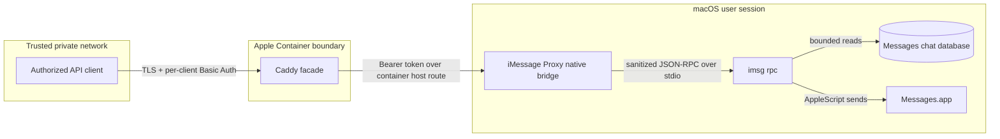

# Architecture

This document explains iMessage Proxy's components, trust boundaries, and design invariants. It describes version 0.3.0; Alpha interfaces may change.

## Design goals

iMessage Proxy exists to make a small subset of Messages functionality available to explicit automation clients without turning a Mac into a general-purpose remote-control server.

The design optimizes for:

- private LAN/VPN operation;
- a narrow, inspectable native bridge;
- deny-by-default outbound messaging;
- independent credentials at each trust boundary;
- ordinary macOS TCC, SIP, Messages, and GUI-session behavior;
- minimal logs and recoverable local state;
- explicit operator actions for security-sensitive lifecycle changes.

Convenience, unrestricted API compatibility, public hosting, and multi-tenant isolation are non-goals.

## System context



The native bridge listens only on `127.0.0.1`. Apple Container's explicit host route connects the facade to that listener. The facade publishes HTTPS only on an operator-selected private interface.

## Topology decision record

**Status:** Accepted for the Alpha topology; review again when the host-routing
capabilities or operational requirements change.

### Context and decision

A pure Apple Container deployment cannot provide live sending. Apple Container
runs a Linux workload in a lightweight virtual machine. The Linux form of
`imsg` can inspect a copied Messages database, but it cannot connect to
Messages.app or send through the signed-in macOS user's identity. Those live
operations require the user's GUI session, AppleScript, and macOS TCC approval.

The externally reachable Caddy facade therefore remains in Apple Container,
where its image can be pinned and its resources and host access constrained.
The smallest host exception is the native bridge: it runs as the signed-in
Messages user and binds only to loopback. The bridge's narrow authenticated
contract is the boundary between the network-facing facade and the
TCC-protected capability; moving Caddy into the container cannot remove that
host bridge.

### Alternative and review criteria

Running Caddy directly on macOS would remove the container-to-loopback route
and its lifecycle side effects. It would also move the network-facing TLS,
authentication, HTTP parsing, and private-CA process onto the host, reducing
the isolation around the most exposed component. The containerized facade is
preferred while the supported route remains usable.

Reconsider a user-scoped host Caddy when the route becomes unsupported or
unreliable, preserving iCloud Private Relay is a deployment requirement, or
manual route recovery no longer meets the availability target. Any change must
preserve the private-interface bind, TLS and per-client authentication, header
separation, size and timeout limits, loopback-only bridge, pinned supply chain,
and existing CA/credential lifecycle. Also revisit this decision if Apple adds
a restart-persistent host-access mechanism without the current side effect.

### Consequences

Apple documents that creating its localhost-domain route disables iCloud
Private Relay and that the associated packet-filter rule is removed by a Mac
restart. A restart therefore requires the explicit, confirmed route refresh
and an end-to-end health check before service is considered recovered. The
manager deliberately does not hide that privileged state change in a generic
autostart loop. An absent, ambiguous, or incorrectly mapped route requires
manual observed-state recovery; it is never a reason to expose the bridge on a
LAN address.

## Components

| Component | Responsibility | Deliberate limitation |
| --- | --- | --- |
| `src/imessage-proxy-bridge.m` | Parse HTTP, authenticate the facade, validate/sanitize JSON, enforce API and target policy, invoke `imsg rpc`, and emit minimal audit events | Loopback-only; no TLS, client credential store, or general RPC passthrough |
| `imsg` | Use supported macOS capabilities to read Messages data and send through Messages.app | Executed as a child process for one sanitized request at a time |
| LaunchAgent | Run the bridge in the signed-in Messages user's GUI session | Never installed as root or as a system daemon |
| `config/Caddyfile` | Terminate TLS, authenticate individual clients, reject non-private sources, cap bodies, and proxy three routes | No anonymous route, broad reverse proxy, or public certificate automation |
| Apple Container | Isolate and resource-bound the Caddy facade | Cannot replace the macOS-side bridge or access TCC-protected host data directly |
| `bin/imessage-proxy` | Build, prepare, inspect, and operate the host and facade | No delete, reset, prune, or silent security-control bypass |

## Request lifecycle

1. A client establishes TLS using iMessage Proxy's private Caddy CA and sends its own Basic Auth credential.
2. Caddy checks that the source is in a private address range, authenticates the client, limits the body, and matches an exact route and method.
3. Caddy removes the client's Authorization header. It adds the bridge bearer token and forwards the authenticated username as caller identity.
4. The bridge accepts the request only on loopback, performs a constant-time token comparison, applies strict HTTP and JSON limits, and sanitizes caller identity before audit logging.
5. The policy layer accepts one allowlisted RPC method, rejects unsupported parameters, forces privacy-preserving values, and checks the exact send target when applicable.
6. The bridge starts `imsg rpc`, writes one JSON-RPC object to standard input, waits within a bounded timeout, and accepts only a bounded JSON response.
7. The response travels back through Caddy. The bridge records caller, method, status, and duration—but not message text or recipient.

Failures stop at the earliest boundary. A request is never retried automatically because retrying a send could duplicate a message.

The lifecycle manager has one additional host-internal proof endpoint:
bearer-authenticated `GET /_internal/configuration-fingerprint`. The bridge
returns only a SHA-256 digest of its immutable startup snapshot, including the
exact token and allowlist file bytes, recognized environment, paths, version,
port, dependency path, timeouts, and concurrency. The manager compares that
live digest with fresh invocations of the same installed bridge under the exact
reviewed LaunchAgent environment. Caddy publishes only the three API routes
above, so clients receive `404` for this internal path.

## Trust boundaries

### Client to facade

The client is authorized for the API but should not be trusted with bridge credentials or host access. Each client receives a unique password so access can be attributed and revoked independently. TLS protects Basic Auth in transit.

### Facade to bridge

The Caddy container is trusted to possess the bridge token and forward an authenticated caller ID. Compromise of the facade does not remove the bridge's method, parameter, target, size, or loopback controls.

### Bridge to macOS capabilities

The bridge and `imsg` run with the permissions of the signed-in macOS user. This is the most sensitive boundary: reads can expose conversations and sends use that user's Messages identity. Full Disk Access and Automation remain operator-controlled through System Settings.

### Repository to runtime state

The checkout contains source and public templates only. Runtime credentials, caller hashes, generated environment, Caddy CA material, binaries, logs, and generated LaunchAgent files live below the configured runtime home. Version 0.3.0 retains the existing default `~/Library/Application Support/Stella` with restrictive permissions.

## State model

The default runtime layout is:

```text
~/Library/Application Support/Stella/
├── secrets/
│   ├── allowed-targets.txt
│   ├── bridge.token
│   ├── facade.env
│   └── users.caddy
└── state/
    ├── bin/stella-bridge
    ├── caddy/
    │   ├── Caddyfile
    │   ├── config/
    │   └── data/
    ├── io.github.mglaeser.stella.bridge.plist
    └── logs/
```

`IMESSAGE_PROXY_HOME` can relocate the root. It must point to a user-owned private directory; it should not be a shared checkout, synchronized folder, or world-readable backup target. `prepare` creates private directories and mode-0600 secret files. The active LaunchAgent plist is installed separately under `~/Library/LaunchAgents/`.

### Rename transition

The repository source and public build artifact use `imessage-proxy-bridge`, but `build-host` installs `stella-bridge` below the runtime home. Version 0.3.0 continues to retain the LaunchAgent label `io.github.mglaeser.stella.bridge`, container `stella`, host route `stella-host.container.internal`, and legacy signing/runtime identities. This is intentional: changing those identities could invalidate TCC approval, rotate Caddy trust state, or orphan a running deployment.

The canonical operator interface is `bin/imessage-proxy` with `IMESSAGE_PROXY_*` variables. The deprecated `bin/stella` shim and `STELLA_*` aliases remain for this transition release. Canonical and legacy values may be used separately, but conflicting definitions fail closed. No state, LaunchAgent, container, route, certificate, or TCC identity is migrated automatically.

## Lifecycle and state domains

Lifecycle decisions must keep independently owned evidence separate:

| Domain | Representative evidence | Rule |
| --- | --- | --- |
| Source | Repository URL, tag, commit, release provenance | A reviewed checkout does not prove what is installed or running |
| Package | Installed CLI, templates, and versioned package files | Package changes do not authorize runtime or legacy-state removal |
| Runtime | Generated bridge binary and plist, LaunchAgent state, processes, listeners, and logs | Inspect the live identity and state before mutation |
| TCC identity | GUI user, executable identity, Full Disk Access, and Messages Automation behavior | File presence or a healthy process does not prove permission |
| Container and route | Image identity, container definition, publication, localhost route, and its live mapping | Container existence does not prove that its transient host path works |
| Secrets and CA | Bridge token, caller hashes, target policy, private key, and enrolled client trust | Never infer that these are disposable or safely reproducible |
| External migration evidence | Orchestrator-owned lock, receipt, provenance, and acceptance state | Preserve and interpret it only under the schema and controller that created it |

A successful observation in one domain is not evidence for another, and
authority to update one domain does not imply authority to delete, adopt, or
recreate another. Inventory results are `present`, `absent`, or `unknown`.
Timeouts, permission errors, malformed output, and unsupported probes are
`unknown`, never proof of absence; security-sensitive mutation stops until the
state is resolved.

The standalone manager does not create, adopt, or interpret deployment
migration receipts. An external migration controller that changes these
domains should:

1. acquire a single-writer lock before its first mutation and treat an
   uncertain existing lock as a blocker;
2. repeat every safety-critical runtime and identity check after acquiring the
   lock;
3. record only metadata and sanitized yes/no observations, never secret
   contents, using versioned schemas and monotonic state transitions;
4. write each state update atomically without reinterpreting or erasing prior
   durable evidence; and
5. stop further writes after interruption or divergence, then choose recovery
   from newly observed state instead of blindly retrying a cutover or running a
   prewritten rollback.

## Security invariants

A change is architecture-compatible only if it preserves all of these properties:

1. The bridge process owns exactly one IPv4 TCP listener, bound to the configured `127.0.0.1` port.
2. No API route works without authentication at both boundaries.
3. Sending is denied unless exactly one target is selected and that target is allowed.
4. Unsupported RPC methods and parameters are rejected before `imsg` starts.
5. Attachment reads, reactions, and conversion remain disabled.
6. Sends use the ordinary AppleScript transport; iMessage Proxy never asks operators to disable SIP or TCC.
7. Request, response, execution-time, socket-time, and concurrency limits remain bounded.
8. Logs omit message content, recipient, raw token, and client password.
9. Runtime secrets never enter the repository.
10. The network facade binds to an explicitly selected private interface, not every interface.
11. Facade creation and restart require the running bridge's authenticated configuration fingerprint to match fresh reviewed state without exposing its preimage.

Changes to an invariant require an explicit security proposal, threat-model update, negative tests, migration plan, and maintainer approval.

## Dependency boundaries

iMessage Proxy intentionally delegates TLS and client password verification to Caddy, and Messages integration to `imsg`. Caddy must come from the official image and be pinned to a reviewed immutable digest. `imsg` must be installed through a trusted channel and its API compatibility revalidated on updates.

Apple Container is an isolation and delivery boundary, not a substitute for authorization. Messages.app, TCC, the local account, private DNS, VPN/LAN policy, host firewall, and physical host security remain part of the deployment's trusted computing base.

## Further reading

- [Apple Container networking and host access](https://github.com/apple/container/blob/main/docs/how-to.md)
- [API reference](api.md)
- [Security model](security.md)
- [Operations](operations.md)
- [Migration from an administration repository](migration-from-administration.md)
